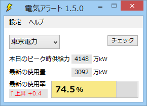
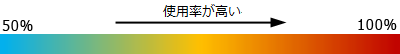
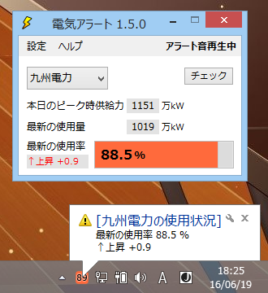
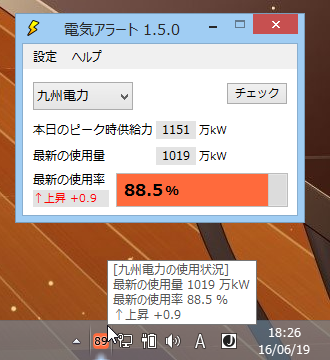
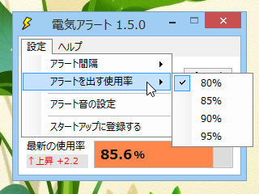
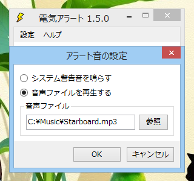
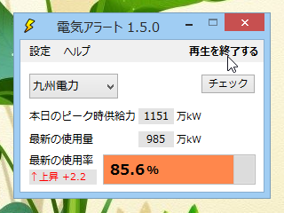

電気アラート
============

日本の全ての電力会社から電力使用状況データを一定間隔で取得し、最新の使用率とその動きを通知領域から色と数字で知らせます。とくに高くなっている場合にはアラートを出します。

##動作条件

 * Windows 7以降
 * .NET Framework 4.6

##ダウンロード

:floppy_disk: [ダウンロード](https://github.com/emoacht/PowerMonitor/releases/download/1.5.0/PowerAlert150.zip)

##使い方

起動するとウィンドウと通知領域にアイコンが表示されます。アイコンの数字と色は使用率を表しています。色の意味は以下のとおり、使用率が高くなるにつれ赤くなっていきます。

対象の電力会社をリストから選択すると、自動的に電力データをチェックし始めます。電力データの取得タイミングは、電力会社ごとの電力データの更新タイミングを見計らって自動的に調整されます。

使用率が設定された閾値以上になると、アラートとして通知領域からバルーンメッセージを出します。

現在の使用状況は通知領域のアイコンにカーソルを重ねることでいつでも確認できます。

アラートを出す使用率の閾値は、80%、85%、90%、95%の中から選択できます（コマンドラインオプションを使えば任意の閾値を加えることも可能）。

アラートのときに鳴らす音も設定できます。音声ファイルとしてはMP3、WMA、WAV、MIDなど、Windows Media Playerと同じ形式のものが再生できます。

音声の再生中はウィンドウの右上角に「アラート音再生中」の表示が出ます。再生を止めるには、この表示にカーソルを重ねて（「再生を終了する」に変わる）クリックしてください。

##ライセンス

 - MIT License